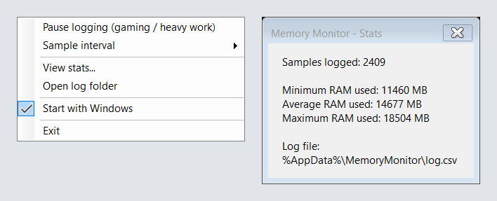

# Memory Monitor

A tiny Windows tray app that logs your system RAM usage over time, so you
can see how much memory you actually need for normal (non-gaming,
non-heavy-work) usage.



## What it does

- Sits in the system tray, showing current RAM usage (used / total / %) in
  its tooltip.
- Every 10 seconds (configurable: 5/10/30/60s via the tray menu) it logs a
  sample to `%AppData%\MemoryMonitor\log.csv`.
- Right-click the tray icon for:
  - **Pause logging (gaming / heavy work)** — stops sampling entirely while
    checked, so gaming/rendering/compiling sessions don't skew your
    baseline.
  - **Sample interval** — how often it samples.
  - **View stats...** — min / average / max RAM used across everything
    logged so far.
  - **Open log folder** — jump straight to the CSV.
  - **Start with Windows** — toggles a per-user startup entry (no admin
    rights needed).
  - **Exit**.

- You can open `log.csv` in Excel while the app is running: samples taken
  while Excel locks the file are kept in memory and written once it is
  closed, and **View stats...** still works.

## Resource usage

Measured on this machine:
- **~10 MB** of memory privately owned by the process (the rest of what
  Task Manager shows as "working set" is the shared .NET runtime, already
  loaded by other .NET apps — not memory this app costs you uniquely).
- **0.000s CPU** measured over a 20-second idle window including a sample
  tick — it does nothing between samples.
- Single thread doing UI/timer work; no background polling thread.

This is achieved by:
- Reading RAM directly via the Win32 `GlobalMemoryStatusEx` API (no WMI,
  no polling library).
- Using a WinForms `Timer` (message-driven, on the existing UI thread) —
  not a `Thread` or `Task` loop.
- Workstation (non-server) GC, no tiered PGO background thread,
  invariant globalization — trims idle background work.
- Framework-dependent deployment, so it shares the OS's installed .NET
  runtime DLLs instead of loading a private copy (self-contained builds
  measured ~110 MB private memory vs. ~10 MB framework-dependent).
- Pausing stops the timer outright — zero timer ticks, not just skipped
  logging.

## Requirements

.NET 8 Desktop Runtime (or SDK) installed. If you don't have it:
https://dotnet.microsoft.com/download/dotnet/8.0

## Build & run

```bash
cd src/MemoryMonitor
dotnet publish -c Release
```

The executable is produced at:
`src/MemoryMonitor/bin/Release/net8.0-windows/publish/MemoryMonitor.exe`

Run it directly, or copy it somewhere permanent (e.g.
`%LocalAppData%\MemoryMonitor\`) before enabling "Start with Windows",
since the startup entry points at wherever the .exe currently is.

## Reading your results

After a few days of normal usage (with gaming/heavy-work sessions
paused), open **View stats...** — the **average** and **max** RAM used
during logged (non-paused) time is a good real-world estimate of how much
RAM your normal workload needs. Add some headroom (a few GB) for future
apps/tabs and that's your target.

## License

[MIT](LICENSE)
